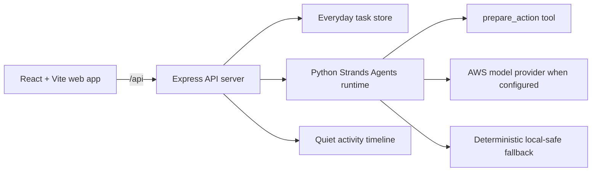

# Everyday Agent

Everyday Agent is a quiet personal operations assistant for people carrying too
many small responsibilities at once. It handles the repetitive work across
home, money, health, errands, and family, then only interrupts when a decision
needs a human.

## Who it is for

It is for busy parents, caregivers, professionals, and anyone who wants life
admin to stop consuming their attention. The agent is intentionally
approval-first: low-risk preparation can happen quietly, while spending money,
making health decisions, or sending something externally stays behind a clear
approval step.

## How it works

1. Add a recurring task such as “review the electricity bill” or “restock the
   household staples”.
2. Everyday Agent runs a Strands Agents SDK workflow that reads the task,
   prepares the smallest useful next action, and classifies it as either
   `auto_completed` or `needs_approval`.
3. The dashboard shows what happened, how much time was saved, and the small
   set of decisions waiting on you.
4. Approve only the actions that need you. The activity timeline keeps a
   lightweight record of the quiet work.

## Architecture



The Strands runtime is deliberately isolated in `agent_runtime/agent.py`. It
can use the default Strands model provider in an AWS-enabled environment and
falls back to a deterministic local-safe response when model credentials are
not present, so the demo is still runnable without secrets.

## Run locally

Requirements: Node.js 24+, pnpm, and Python 3.13+.

```bash
pnpm install
pnpm --filter @workspace/api-spec run codegen
pnpm --filter @workspace/api-server run dev
# in another terminal
pnpm --filter @workspace/everyday-agent run dev
```

The project includes the `strands-agents` Python dependency in `pyproject.toml`.
To use a live AWS model, configure the AWS credentials and model-provider
settings supported by the Strands Agents SDK in your environment. Never commit
credentials.

## Project map

- `artifacts/everyday-agent` — React/Vite product surface
- `artifacts/api-server` — Express API and approval workflow
- `agent_runtime/agent.py` — Strands Agents SDK runtime and safety boundary
- `lib/api-spec/openapi.yaml` — source-of-truth API contract
- `docs/architecture.md` — architecture notes and demo flow
- `docs/demo-script.md` — sub-five-minute recording script
- `LICENSE` — MIT license

## Demo and submission notes

The app is designed for a short screen recording: run one low-risk home task,
show the resulting quiet completion, then run the money task and demonstrate the
approval boundary. A ready-to-read narration is in
[`docs/demo-script.md`](docs/demo-script.md).

For the submission, publish this repository to a public GitHub URL, add that
URL to the entry form, and include your AWS Builder ID. A live deployed link is
optional but recommended.